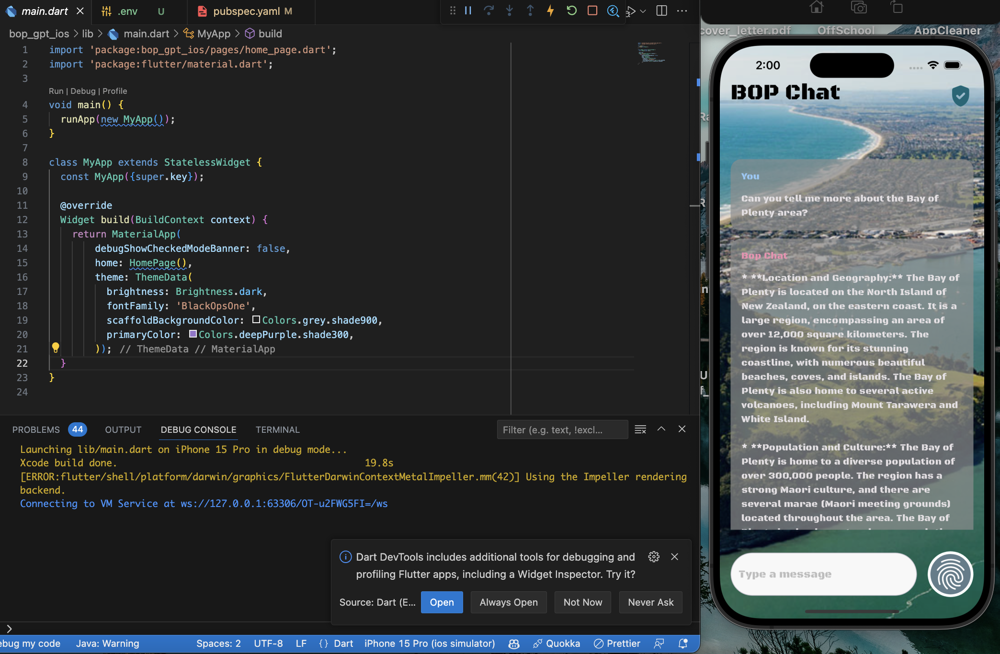

# bop_gpt_ios

A new Flutter project.

## Getting Started

While working on a mobile display program, we wrote a simulation program in Flutter. Due to time constraints, I'm only simulating our locally running LLM via the Google Gemini API for now When deployed in the development environment, all members of the organization will be able to get the aid of BOPRC's autonomy to train the LLM by using the API.

#### Replace your API key in the following file

```
lib/utils/constants.dart
```

### Using the ios 17.2 simulator debugging,



### Running release version on the iPhone 15


